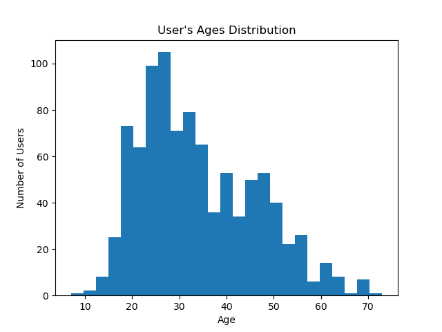
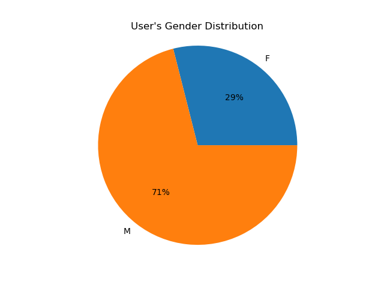
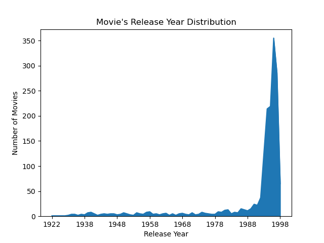

# Recommender System Project – Movielens100k

610521224 陳皓妤

410721249 陳俊仁

## Data discription

- 根據 ml-100k 中 readme.md 的描述：

    u.data 有 100000 筆資料，u1.base～u5.base 各有 80000 筆資料，u1.test～u5.test 各有 20000 筆資料。

- u.data u1～u5 中都有 4 個 columns：

    user id | item id | rating | timestamp

- u.user 中有 5 個 columns：

    user id | age | gender | occupation | zip code

    其中 age 的分佈爲：

    

    gender 的分佈爲：

    

    occupation 的分佈爲：

    

- u.item 中有 24 個 columns：

    movie id | movie title | release date | video release date |
    IMDb URL | unknown | Action | Adventure | Animation |
    Children's | Comedy | Crime | Documentary | Drama | Fantasy |
    Film-Noir | Horror | Musical | Mystery | Romance | Sci-Fi |
    Thriller | War | Western

    其中 release date ( modified to release year ) 的分佈爲：

    

    各個 genre 的分佈爲：

    

## Program discription

### Item Base Collaborative Filtering Model

實作方法：

1. 使用 pandas 的 pivot 將 rating data 轉換成 item-to-user 的稀疏矩陣。
2. 使用 sklearn 的 NearestNeighbors 由 item-to-user 矩陣取得 k-neighbor’s cosine similarity 還有 k-neighbor’s indices。
3. 照公式 $\widehat{rate}=\cfrac{\sum (similarity \times rate)}{\sum similarity}$ 得出預測的 rating 的值。
4. 計算 RMSE 衡量預測值的誤差。

Code 如下：

```python
class Item_Base_CF:
    def __init__(self, n_neighbors=3) -> None:
        self.item_user = np.empty((1682, 943))
        self.n = n_neighbors
        self.knn = NearestNeighbors(n_neighbors=self.n, metric="cosine")
        self.distances, self.indices = np.empty((1682, self.n)), np.empty((1682, self.n))
        self.similarities = np.empty((1682, self.n))

    def fit(self, data):
        self.item_user = data.pivot(index="item_id", columns="user_id", values="rating")
        # Fail to adjust item-to-user matrix with mean of user-ratings
        # self.item_user = self.item_user.subtract(self.item_user.mean(axis=1), axis = 0).fillna(0)
        self.item_user = self.item_user.reindex(index=np.arange(1,1683), fill_value=0).fillna(0)
        # Use sklearn NearestNeighbors to find n similar item's indices & cosine similarities
        self.knn.fit(self.item_user)
        self.distances, self.indices = self.knn.kneighbors(n_neighbors=self.n)
        self.similarities = 1 - self.distances

    def predict(self, item_id, user_id, epsilon=1e-8):
        # Function to predict rating via item_id & user_id
        # Using formula in 01_Neighborhood-based_collaborative_filtering.pptx page 32
        pred_r = self.item_user.iloc[item_id-1,user_id-1]
        sim, ind = self.similarities[item_id-1], self.indices[item_id-1]
        product = 1
        product_sum = 0
        if self.item_user.iloc[item_id-1,user_id-1]!=0:
            return pred_r
        else:
            for i in range(len(ind)):
                product = self.item_user.iloc[ind[i],user_id-1] * sim[i]
                product_sum += product
            pred_r = product_sum / (np.sum(sim)+epsilon)
        return pred_r

    def RMSE(self, data):
        # Function to calculate RMSE of predicted rating & actual rating
        x = data[["item_id", "user_id"]].to_numpy()
        y = data[["rating"]].to_numpy()
        losses = []
        for i in range(len(x)):
            losses.append((self.predict(x[i][0], x[i][1]) - y[i]).item())
        return sqrt(np.nanmean(np.square(losses)))
```

輸出結果：

```python
# Number of neighbors set
k = [2, 4, 8]
```

使用 u1～u5 的資料集進行 5 次 RMSE 輸出，計算其平均值。

已知若使用所有預測值皆爲 0 的 model，其 5 次的 RMSE 輸出將會落在 3.6, 3.7 左右，相較之下 Item Base CF 的誤差值有顯著的減少。

```
----------2-neighbors----------
u1.test RMSE : 2.8520523211052926
u2.test RMSE : 2.687808126654529
u3.test RMSE : 2.603465358260204
u4.test RMSE : 2.647911007490916
u5.test RMSE : 2.7360450020224687
mean : 2.705456363106682
----------4-neighbors----------
u1.test RMSE : 2.7258851793259886
u2.test RMSE : 2.5596291495946533
u3.test RMSE : 2.4705296126894747
u4.test RMSE : 2.526707312903369
u5.test RMSE : 2.62215865725013
mean : 2.580981982352723
----------8-neighbors----------
u1.test RMSE : 2.6828780812337185
u2.test RMSE : 2.500036414134187
u3.test RMSE : 2.425303738135374
u4.test RMSE : 2.4748264591987574
u5.test RMSE : 2.575107201472646
mean : 2.5316303788349366
```